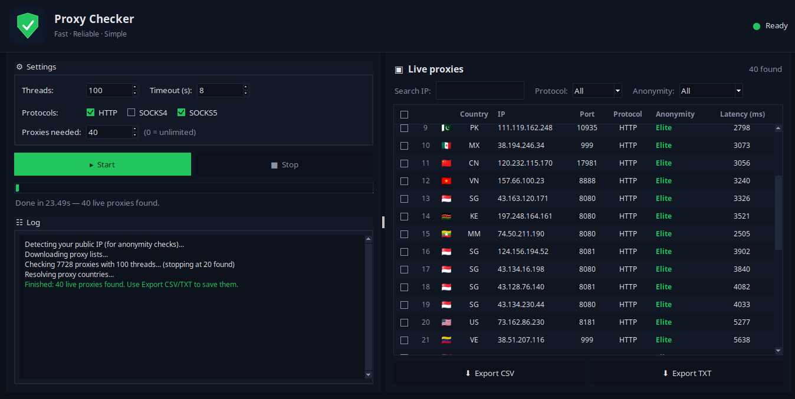

# Proxy Checker (GUI Edition)

A fast, multithreaded HTTP/SOCKS4/SOCKS5 proxy checker with a desktop GUI. It
pulls proxy lists from several free public sources, tests each proxy
concurrently, detects its anonymity level, geolocates it and shows live,
sortable, filterable results in a single window.



## Features

- 🖥️ **Desktop GUI** (Tkinter, no extra GUI dependency) — a single,
  resizable window split into two columns: **Process** (settings, controls,
  progress bar, log) on the left and a live-updating **Results** table on
  the right.
- 🧦 **HTTP, SOCKS4 and SOCKS5** proxies are all fetched and checked.
  Connecting through SOCKS4/SOCKS5 proxies uses `requests[socks]`
  (PySocks); if PySocks isn't installed, SOCKS proxies are skipped
  automatically and HTTP proxies still work.
- 🕵️ **Anonymity level detection** — every live proxy is classified as
  **Transparent** (leaks your real IP to the target site), **Anonymous**
  (adds forwarding headers but hides your real IP) or **Elite** (adds no
  forwarding headers at all), and color-coded in the results table. See
  [How checks work](#how-checks-work) below.
- 🌍 **Country flags** — shown as actual small flag icons (downloaded from
  flagcdn.com), not emoji, so they render correctly even on Linux systems
  without a color-emoji font.
- ⏱️ **Latency (ms)** — round-trip time of the check request, in
  milliseconds, shown per proxy.
- 🔢 **Row numbering** and a live "N found" counter.
- ↕️ **Sortable columns** — click any column header to sort ascending,
  click again to sort descending.
- 🔎 **Filters** — live search by IP substring, plus dropdown filters for
  protocol and anonymity level.
- 🖱️ **Right-click menu** on any result row — copy IP, IP:port, full proxy
  URL (`socks5://ip:port`), or the whole row.
- 🚀 **Multithreaded** checking (configurable thread count, default 100).
- 📚 **Multiple proxy sources per protocol**, merged and deduplicated, so
  one dead source doesn't stop a run.
- 🎯 **Protocol picker and target count** — choose which of HTTP/SOCKS4/SOCKS5
  to check, and optionally stop automatically once a set number of live
  proxies has been found instead of always checking every proxy.
- ⏹️ **Start/Stop control** — cancel a run in progress at any time.
- 💾 **CSV and TXT export, on demand only** — nothing is written to disk
  automatically; click **Export CSV** / **Export TXT** and choose where to
  save.
- 🧵 Fully non-blocking UI — networking happens on background threads and
  reports progress through a thread-safe queue.
- 📦 **Standalone builds** — a Windows `.exe`, a raw Linux binary, and a
  Linux **AppImage** (download, `chmod +x`, run — no install, no Python
  needed) are all built automatically by GitHub Actions and attached to
  each GitHub Release.

## Project layout

```
proxy_checker/
├── main.py                        # entry point, launches the GUI
├── requirements.txt
├── assets/
│   ├── icon.png / icon.ico          # app icon (used by the GUI window and the builds)
│   └── generate_icon.py              # one-off script that (re)generates the icon
├── docs/
│   └── screenshot.png                # README screenshot
├── .github/workflows/
│   └── release-build.yml           # builds .exe / Linux binary / AppImage on tag push
├── src/
│   ├── config.py                    # thread count, timeouts, sources, URLs
│   ├── sources.py                    # downloads & merges HTTP/SOCKS4/SOCKS5 lists
│   ├── geoip.py                       # batch country lookups + flag icons
│   ├── checker.py                      # threaded checking engine (liveness + anonymity)
│   └── gui.py                           # Tkinter GUI (single window, two-column layout)
└── README.md
```

## Requirements

- Python 3.10+
- `requests[socks]` (see `requirements.txt` — pulls in PySocks for SOCKS
  proxy support)

Tkinter ships with the standard Python installer on Windows and macOS.
On Linux you may need to install it separately, e.g. on Debian/Ubuntu:

```bash
sudo apt install python3-tk
```

## Installation

```bash
git clone git@github.com:agteamdev/proxy_checker.git
cd proxy_checker
python -m venv .venv
source .venv/bin/activate        # Windows: .venv\Scripts\activate
pip install -r requirements.txt
```

## Usage

```bash
python main.py
```

1. In the left "Settings" panel, (optionally) adjust **Threads** and
   **Timeout**, pick which **Protocols** to check (HTTP/SOCKS4/SOCKS5), and
   optionally set **Proxies needed** to stop automatically once that many
   live proxies are found (`0` = check everything).
2. Click **Start**.
3. Watch the right-hand "Live proxies" table fill up in real time: flag,
   #, country, IP, port, protocol, anonymity, latency — while the left
   panel shows progress and a log.
4. Use the search box and the Protocol/Anonymity dropdowns above the table
   to filter; click any column header to sort by it.
5. Right-click any row to copy its IP, IP:port, proxy URL, or the full row
   — or tick the checkboxes on several rows and copy them all at once.
6. Click **Stop** at any time to cancel; already-found proxies are kept.
7. Nothing is saved automatically. Click **Export CSV** / **Export TXT**
   under the results table whenever you want to save a snapshot, and
   choose where.

## How checks work

Each HTTP, SOCKS4 or SOCKS5 proxy is tested with a **single HTTPS request** through
the tunnel, to `https://httpbin.org/get`, which echoes back every header it
received:

- **Alive / dead**: if the request fails, times out, or doesn't return
  HTTP 200, the proxy is dropped immediately and never appears in the
  results — only proxies that pass this check are shown or exported.
- **Latency (ms)**: the round-trip time of that same request, in
  milliseconds — how long it took the proxy to fetch the page and return
  it. Lower is faster.
- **Anonymity level**: determined by inspecting which headers the target
  site (httpbin.org) actually received:
  - **Transparent** — the response shows your *real* public IP was
    forwarded to the target site (checked once at startup via
    `api.ipify.org`). Sites can trivially tell who's behind the proxy.
  - **Anonymous** — the proxy added forwarding-related headers (`Via`,
    `X-Forwarded-For`, `Forwarded`), but did not leak your real IP.
  - **Elite** — no forwarding headers were added at all; the target site
    cannot tell a proxy is being used.

## GeoIP attribution

Country lookups use the free [ip-api.com](https://ip-api.com) batch
endpoint (no API key required, 45 requests/minute limit, respected by
batching up to 100 IPs per request in `geoip.py`). Flag icons are fetched
from [flagcdn.com](https://flagcdn.com).

## Configuration

All defaults (thread count, timeout, proxy sources, check endpoints, output
file names) live in `src/config.py` and can be edited directly, or adjusted
per-run from the GUI (threads/timeout).

## Building standalone binaries (Windows .exe / Linux binary / AppImage)

Binaries are built automatically by `.github/workflows/release-build.yml`
whenever a tag starting with `v` is pushed:

```bash
git tag -a vX.Y.Z -m "Release notes for this version"
git push origin vX.Y.Z
```

This creates (or updates) the GitHub Release for that tag with:
- `proxy-checker-windows.exe` — Windows, run it directly
- `proxy-checker-linux` — raw Linux binary, `chmod +x` then run
- `ProxyChecker-x86_64.AppImage` — Linux, `chmod +x` then double-click or
  run; no installation, no Python required

To build locally instead:

```bash
pip install pyinstaller
pyinstaller --onefile --windowed --name proxy-checker --icon assets/icon.ico --add-data "assets;assets" main.py   # Windows
pyinstaller --onefile --name proxy-checker --icon assets/icon.png --add-data "assets:assets" main.py               # Linux/macOS
# binary/exe appears in dist/
```

## Roadmap ideas

- Standalone macOS build.
- Per-proxy retry / re-check button in the results table.
- Save/restore filter and sort preferences between runs.

## License

MIT License — see [LICENSE](LICENSE).
